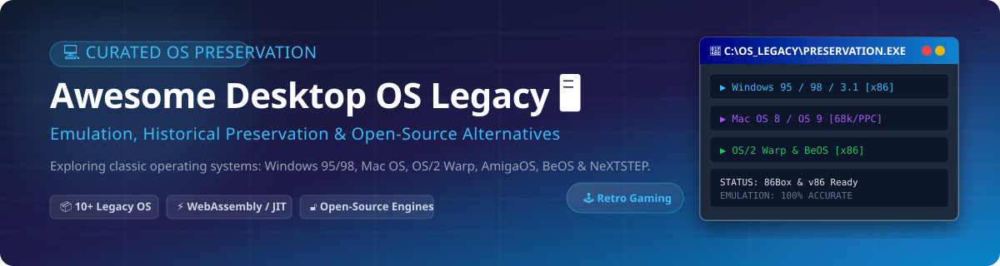

# 🖥️ Awesome Desktop Operating System Legacy 💾

  
  
  
  

> **Curated List of Legacy Operating Systems, Emulators, Retro Computing Tools & Open-Source Alternatives**
> 
> *Focused on Low-Level Hardware Emulation, WebAssembly Virtualization, Digital Preservation & Modern Reimplementations of Classic Desktop OS*

---

## 💡 Overview & SEO Context

Welcome to **Awesome Desktop Operating System Legacy**! This curated directory provides a comprehensive guide to **classic operating system preservation**, **retro computing emulation**, and **open-source desktop reimplementations**. Whether you are looking to run **Windows 95 in WebAssembly**, emulate **NeXTSTEP with JIT compilation**, run **Mac OS 9 via PowerPC emulation**, or explore modern retro-inspired projects like **SerenityOS**, this resource covers the best tools and software architecture available today.

---

## 📖 Table of Contents 🧭

- [💾 Commercial & SaaS Preservation Platforms](#-commercial--saas-preservation-platforms)
- [🕹️ Legacy Operating Systems](#%EF%B8%8F-legacy-operating-systems)
- [🔓 Open-Source Alternatives & Emulators](#-open-source-alternatives--emulators)
- [🤝 How to Contribute](#-how-to-contribute)
- [❤️ Support & Sponsorship](#%EF%B8%8F-support--sponsorship)
- [⚠️ Disclaimer](#%EF%B8%8F-disclaimer)
- [📈 Star History](#-star-history)

---

## 💾 Commercial & SaaS Preservation Platforms 🌐

> **📊 Sector Market Context & Industry Dynamics**:
> - **Estimated Market Size**: The legacy OS preservation, enterprise application retrofitting, and cloud virtualization market is estimated at **$1.8 Billion annually**.
> - **Market Fragmentation**: The sector is **moderately fragmented**. While cloud infrastructure giants dominate general virtualization, specialized legacy OS hosting and retro software emulation remain split across niche commercial vendors and open-source emulator ecosystems.

### 🏢 SaaS & Commercial Platforms Leaderboard

| Product / Company | Description | Company Size (Valuation / Revenue) | Starting Pricing Tier | Free Tier Limits |
| :--- | :--- | :--- | :--- | :--- |
| **[VMware Workstation Pro](https://www.vmware.com/)** *(Broadcom)* | Industry-standard desktop hypervisor for running legacy x86 operating systems, Windows 95/98/NT, and legacy Linux. | **$61.0 Billion** *(Broadcom Software annual revenue)* | **$120.00/year** *(Workstation Pro commercial tier)* | **Free for Personal Use** *(VMware Workstation Pro is free for non-commercial use with full hypervisor capabilities)* |
| **[Parallels Desktop](https://www.parallels.com/)** *(Alludo / KKR)* | Desktop virtualization software for running legacy Windows and macOS environments. | **$1.0 Billion** *(Parent company Alludo valuation)* | **$99.99/year** *(Standard Edition)* | **14-Day Free Trial** *(Full functionality trial for 14 days)* |
| **[ArcaOS](https://www.arcanoae.com/)** *(Arca Noae)* | Modernized commercial continuation of IBM OS/2 Warp 4, supporting legacy OS/2 software on modern hardware and hypervisors. | **$5.0 Million** *(Estimated annual revenue)* | **$139.00/license** *(Personal Edition single license)* | **30-Day Money-Back Guarantee** *(No free tier; 30-day refund policy for license evaluation)* |
| **[Infinite Mac Cloud](https://infinitemac.org/)** | Web-based instant Classic Mac OS (System 6 to Mac OS 9) virtualization platform powered by WebAssembly. | **$100.0 Thousand** *(Indie project / donation funded)* | **$5.00/month** *(Patreon supporter tier for hosting)* | **100% Free Forever** *(Unlimited browser sessions with pre-loaded Mac OS System 6 through 9 images)* |

---

## 🕹️ Legacy Operating Systems 📜

| Operating System | Description | Release Era | Current Status | Recommended Emulation Path |
| :--- | :--- | :--- | :--- | :--- |
| **[Windows 95](https://en.wikipedia.org/wiki/Windows_95)** 🪟 | **The OS that introduced the Start menu & taskbar.** 32-bit preemptive multitasking, Plug and Play, long filenames. | **1995** | **Discontinued** *(End of Support: Dec 31, 2001)* | **86Box** (hardware-accurate), **v86** (browser WASM), **DOS Wasm X** |
| **[Windows 98](https://en.wikipedia.org/wiki/Windows_98)** 🪟 | **Refined consumer Windows.** USB support, FAT32, Internet Explorer integration, Windows Update pioneer. | **1998** | **Discontinued** *(End of Support: Jul 11, 2006)* | **86Box** (recommended), **v86** (playable browser games) |
| **[Windows 3.1](https://en.wikipedia.org/wiki/Windows_3.1)** 🪟 | **First widely successful Windows GUI.** 16-bit environment on MS-DOS with Program Manager and Solitaire. | **1992** | **Discontinued** *(End of Support: Dec 31, 2001)* | **86Box** (low-level 8086/286 emulation), **DOSBox-X** |
| **[Mac OS 8](https://en.wikipedia.org/wiki/Mac_OS_8)** 🍎 | **Apple's mature 68k desktop OS.** Multi-threaded Finder, Platinum UI, Sherlock search engine. | **1997** | **Discontinued** *(Superseded by Mac OS 9)* | **Basilisk II** (68k Mac emulator, supports OS 8.1), **Mini vMac** |
| **[Mac OS 9](https://en.wikipedia.org/wiki/Mac_OS_9)** 🍎 | **The final classic Mac OS.** Carbon API, Sherlock 2, multi-user support before Mac OS X. | **1999** | **Discontinued** *(End of Support: 2002)* | **SheepShaver** (PowerPC Mac emulator), **QEMU** (mac99 target) |
| **[OS/2 Warp](https://en.wikipedia.org/wiki/OS/2)** 💻 | **IBM's enterprise multitasking OS.** Preemptive multitasking, HPFS, Workplace Shell object desktop. | **1994** | **Discontinued** *(End of Support: Dec 31, 2006)* | **86Box**, **ArcaOS** (modern commercial continuation), **Virtual PC 2004** |
| **[AmigaOS](https://en.wikipedia.org/wiki/AmigaOS)** 🕹️ | **Multimedia powerhouse of the 80s/90s.** Preemptive multitasking, custom coprocessors, Workbench desktop. | **1985** | **Active Development** *(v4.x on PPC)* | **WinUAE** (full hardware accuracy + JIT), **FS-UAE** |
| **[BeOS](https://en.wikipedia.org/wiki/BeOS)** ⚡ | **Media-optimized OS with pervasive multithreading.** 64-bit BFS filesystem, modular media kit. | **1995** | **Discontinued** *(Be Inc. acquired 2001)* | **Haiku** (open-source clone), **86Box**, **VirtualBox** |
| **[NeXTSTEP](https://en.wikipedia.org/wiki/NeXTSTEP)** 🖥️ | **The foundation of modern macOS & iOS.** Objective-C, Display PostScript, Interface Builder GUI. | **1988** | **Discontinued** *(Merged into Apple 1997)* | **Previous** (68030/68040 JIT emulator), **VMware** |
| **[MS-DOS](https://en.wikipedia.org/wiki/MS-DOS)** ⌨️ | **The foundation of PC computing.** Command-line environment, FAT filesystem, iconic game library. | **1981** | **Discontinued** *(End of Support: 2001)* | **FreeDOS** (open-source), **DOSBox-Staging**, **DOS Wasm X** |

---

## 🔓 Open-Source Alternatives & Emulators 🚀

> Sorted by GitHub Star count (descending). Badges link directly to each repository's stargazers page.

| Repository | Description | Stargazers Badge | Star Count |
| :--- | :--- | :--- | :--- |
| **[QEMU](https://github.com/qemu/qemu)** ⚡ | Generic machine emulator and virtualizer. Emulates classic PowerPC Macs (Mac OS 9), x86 systems, SPARC, and MIPS. |  | **~38,500** |
| **[SerenityOS](https://github.com/SerenityOS/serenity)** 🎨 | Modern Unix-like OS written from scratch with a 1990s graphical interface aesthetic, built-in browser, and desktop apps. |  | **~35,200** |
| **[v86](https://github.com/copy/v86)** 🌐 | x86 virtualization running in browser WebAssembly. Boots Windows 95, Windows 98, and MS-DOS with zero plugins. |  | **~22,400** |
| **[Haiku](https://github.com/haiku/haiku)** 🌿 | Open-source operating system specifically targeting personal computing, inspired by BeOS. Fast, lightweight, and desktop-first. |  | **~7,800** |
| **[DOSBox-Staging](https://github.com/dosbox-staging/dosbox-staging)** 🎮 | Modernized, highly active fork of DOSBox focusing on modern rendering, low latency audio, and retro gaming accuracy. |  | **~4,200** |
| **[86Box](https://github.com/86Box/86Box)** 📟 | Low-level hardware-accurate x86 emulator (8086 through Celeron). Runs MS-DOS, Windows 9x, OS/2, BeOS, and NeXTSTEP. |  | **~3,500** |
| **[FreeDOS](https://github.com/FDOS/kernel)** 💾 | Open-source MS-DOS compatible operating system kernel and tools. Runs legacy DOS software and games natively on x86. |  | **~2,100** |
| **[FS-UAE](https://github.com/FrodeSolheim/fs-uae)** 🕹️ | Amiga emulator based on WinUAE code with focus on cross-platform support and modern graphical user interface. |  | **~950** |
| **[DOS Wasm X](https://github.com/nbarkhina/DosWasmX)** 💻 | WebAssembly DOSBox-X wrapper for running Windows 95/98 ISOs in modern web browsers with local storage persistent saves. |  | **~520** |
| **[Previous JIT](https://github.com/rcarmo/previous-jit)** 🖥️ | NeXT computer emulator with JIT acceleration. Emulates 68030/68040 hardware, MMU, and DSP for running NeXTSTEP. |  | **~120** |
| **[III-Millennium OS](https://github.com/511break-AS/III-Millennium-OS)** 🤖 | Experimental 32-bit OS in C & Assembly featuring a classic GUI, Ext2 filesystem, TCP/IP stack, and local AI assistant. |  | **~110** |

---

## 🤝 How to Contribute 🛠️

Contributions are welcome! To contribute to **Awesome Desktop Operating System Legacy**:

1. **Fork** the repository on GitHub.
2. Create a feature branch (`git checkout -b add-new-emulator`).
3. Add your entry to `README.md` maintaining alphabetical/tabular order and formatting guidelines.
4. Ensure all project links are valid and descriptions adhere to factual retro computing history.
5. Refer to [Awesome-Awesome-Awesome](https://github.com/ishandutta2007/Awesome-Awesome-Awesome) for general list guidelines.
6. Open a **Pull Request** with a detailed summary.

---

## ❤️ Support & Sponsorship ☕

If you find this legacy operating system catalog useful for your research, preservation work, or retro computing hobby:

- ⭐ **Star** this repository on GitHub to boost visibility.
- 🔀 **Fork** it to keep your own copy of these essential tools.
- 📢 **Share** it with retro computing communities, subreddits, and forums.
- 💖 **Sponsor**: Buy me a coffee and support open-source preservation lists via [GitHub Sponsors](https://github.com/sponsors/ishandutta2007).

---

## ⚠️ Disclaimer 🔒

- **Educational & Historical Context**: This repository is a community-curated directory intended solely for educational, digital preservation, and software archaeology purposes.
- **Security Notice**: Legacy operating systems (Windows 95, Windows 98, MS-DOS, Classic Mac OS) are end-of-life and contain unpatched security vulnerabilities. They should **never** be exposed directly to untrusted networks or used for production workloads.
- **Copyright & Licensing**: This repository does not host, mirror, or distribute proprietary ROMs or copyrighted operating system disk images. All software media must be legally acquired by the end user.

---

## 📈 Star History

